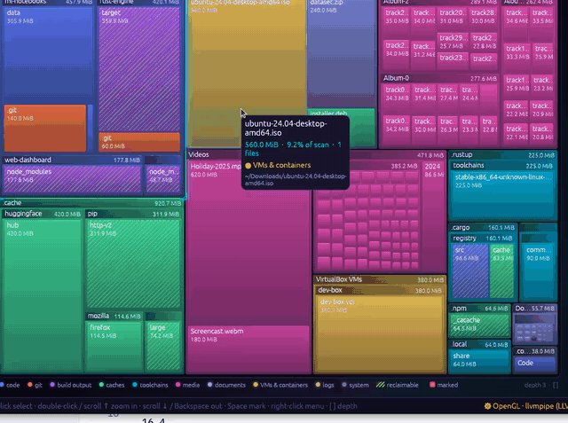
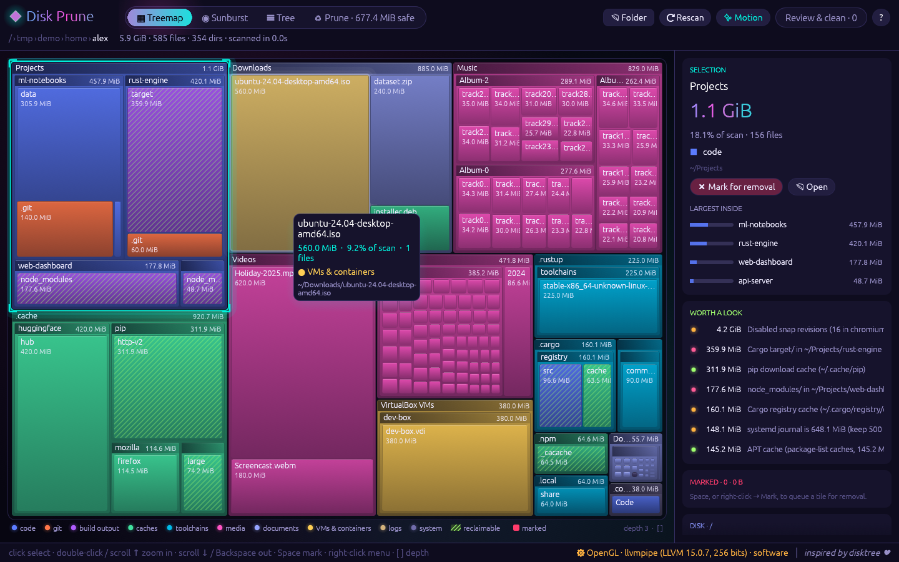
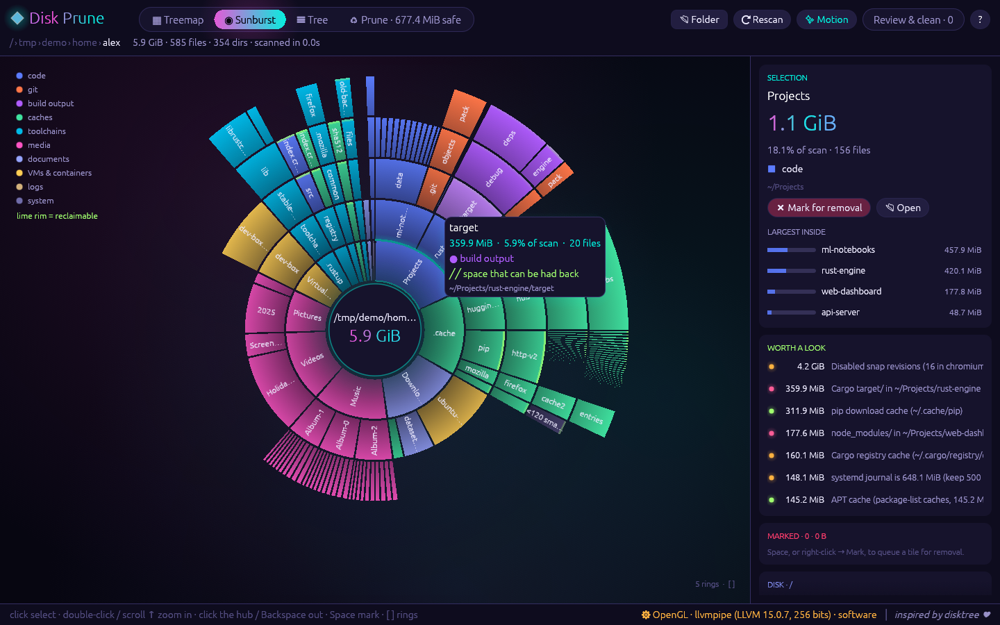
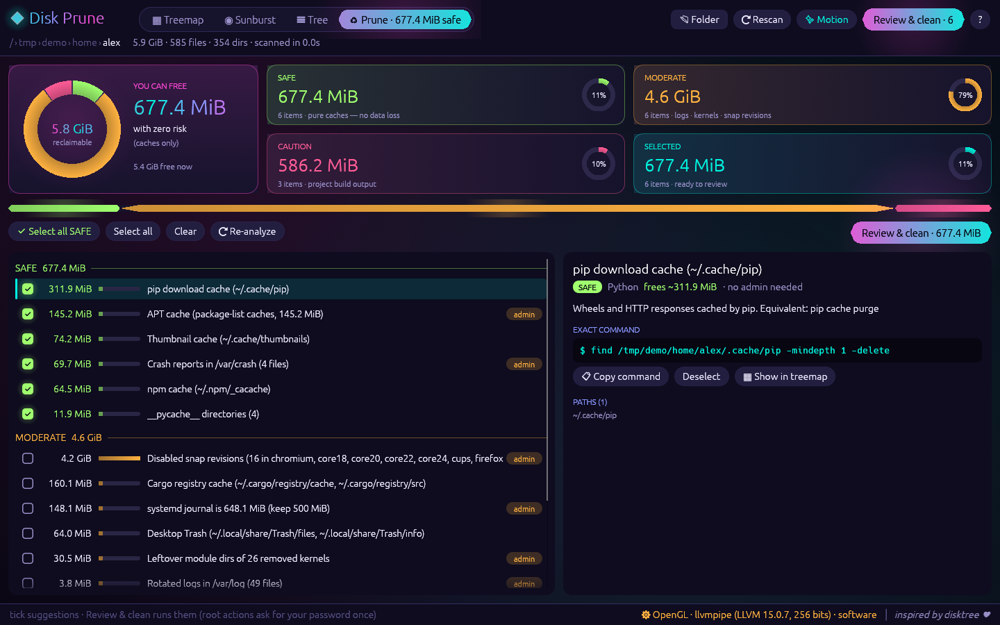
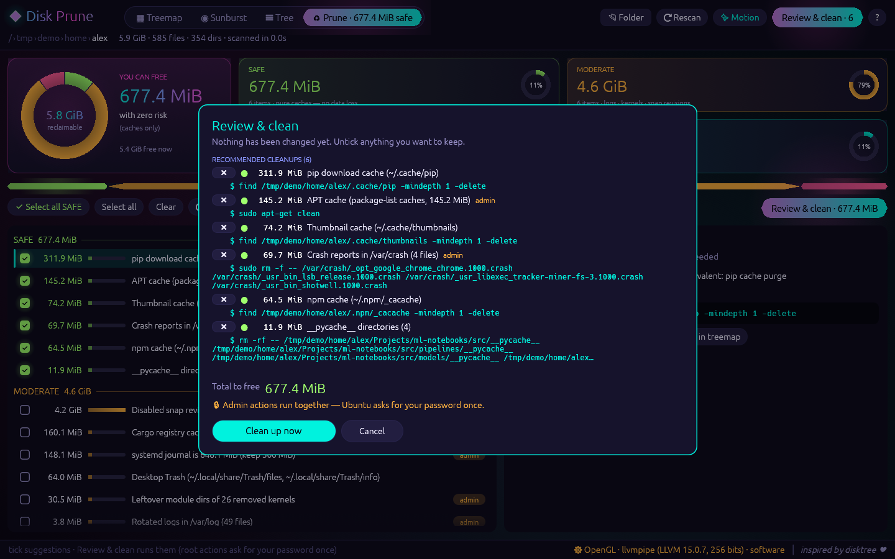
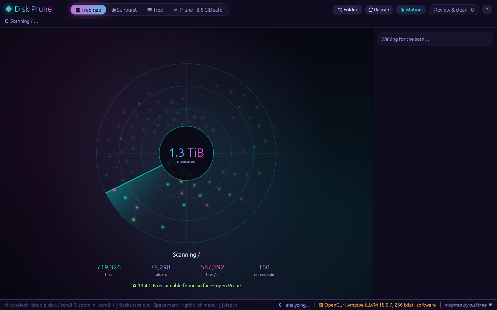
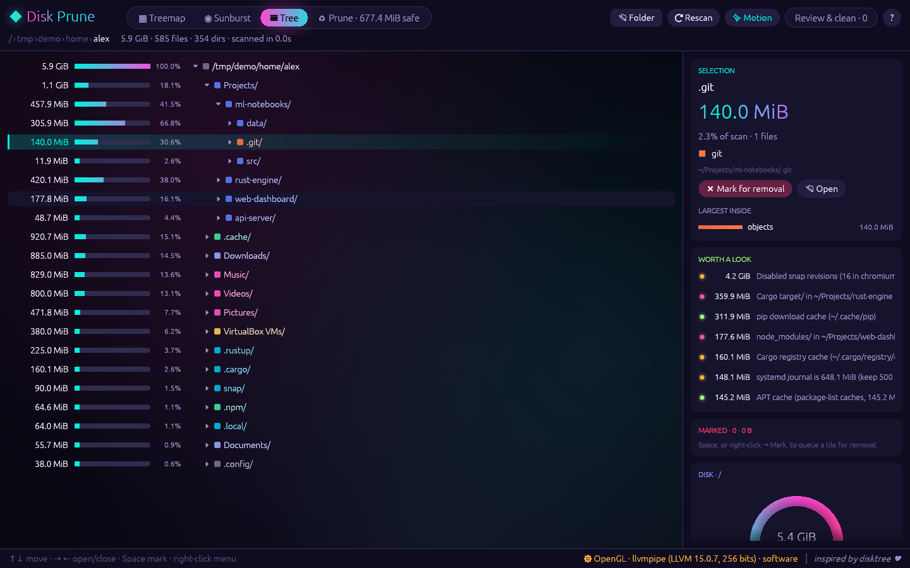
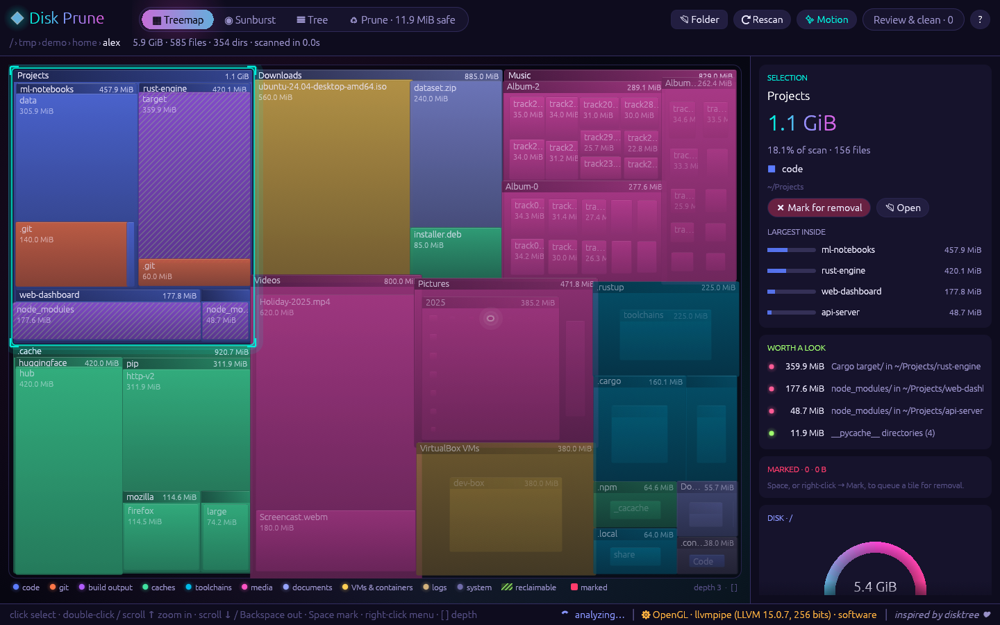
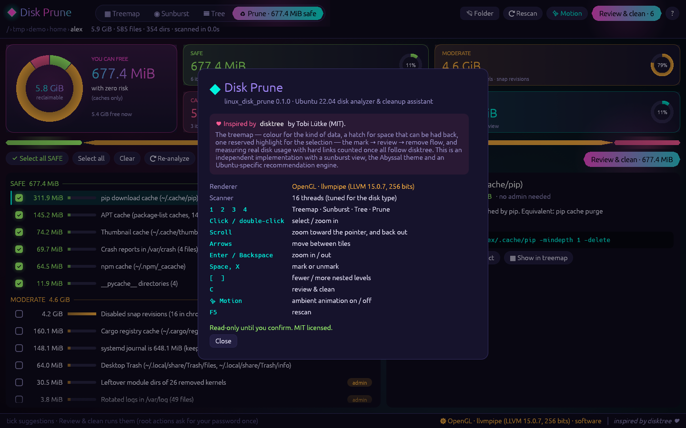

<div align="center">

# ◆ Disk Prune

**A fast, good-looking disk analyzer and *safe* cleanup assistant for Ubuntu 22.04, written in Rust.**

See where your space goes as a treemap or sunburst, then reclaim it with a recommendation engine that knows Ubuntu: APT caches, old kernels, snap revisions, the journal, developer caches and build output. It shows exactly how much each item frees and the exact command it will run.



*Inspired by [disktree](https://github.com/tobi/disktree) by Tobi Lütke ♥*

</div>

---

## Screenshots

| Treemap | Sunburst |
|---|---|
|  |  |
| **Prune dashboard** | **Review before anything runs** |
|  |  |
| **Scanning (sonar)** | **Tree** |
|  |  |
| **Bloom-in animation** | **About & credits** |
|  |  |

<sub>The screenshots use a synthetic demo home folder.</sub>

## Why Disk Prune? How it compares to disktree

[disktree](https://github.com/tobi/disktree) is a lovely treemap for finding what fills a disk, built for Omarchy (Arch) with GPUI. Disk Prune started from its ideas and goes further in the direction of **telling you what is safe to delete on Ubuntu, and doing it for you, safely**.

| | disktree | **Disk Prune** |
|---|---|---|
| What gets flagged as reclaimable | Hatched by folder *kind*: caches, sync history, package stores, build output | A **rule engine for Ubuntu 22.04**: APT cache, inactive kernels, disabled snap revisions, journal, rotated logs, crash dumps, pip/cargo/npm, Docker, Rust `target/`, `node_modules`, `__pycache__`. Each finding has a size, a risk tier and the exact command |
| System cleanup | Refuses package-managed trees and points you to the right tools | **Runs those tools for you**: `apt-get clean`, kernel purge (dry-run with `apt-get -s` first), `snap remove --revision`, `journalctl --vacuum-size`, all behind **one** `pkexec` password prompt with a live log |
| Risk guidance | Remove or keep | **SAFE / MODERATE / CAUTION** tiers, with a plain-language reason and a "free now vs. after" gauge |
| Views | Treemap | Treemap, **sunburst**, size tree and a prune dashboard |
| Hardware | Needs a GPU that GPUI can drive (Vulkan) on Wayland/X11 | Vulkan on the integrated GPU when it can present, **automatic OpenGL fallback**, and it works on virtual/remote displays |
| No display? | — | **Terminal UI** (`--tui`) over SSH, plus `--summary` / `--json` for scripts and cron |
| Install on Ubuntu | Build from source or tarball | **`.deb` package** with launcher entry, icon and *Open with* for folders |
| Verification | Removal rules are unit-tested | 83 unit tests plus an **independent black-box suite (178 checks)** comparing every number against GNU `du`, including hostile file names and false-positive traps |

**Where disktree is still ahead.** It has an *Age* colouring mode, name filtering, git status for checkouts (changes, stashes, unpushed commits), smooth magnify-zoom and panning, btrfs subvolume awareness, and a memoised scan that widens from `~` to `/` without rescanning. If you are on Omarchy/Arch, use disktree. If you are on Ubuntu and want to reclaim space rather than just find it, that's what Disk Prune is for.

## Features

### Four ways to look at a disk
- **▦ Treemap:** a nested, squarified mosaic.
  - Colour shows the *kind* of data: code, git, build output, caches, toolchains, media, documents, VMs & containers, logs, system.
  - Space you can reclaim gets marching lime stripes.
  - Tiles bloom in, and zooming (double-click or scroll) animates into place.
- **◉ Sunburst:** the hierarchy as concentric rings, with a clock-wipe intro, radial labels and lime rims on reclaimable space. Click the glowing hub to go up.
- **☰ Tree:** a virtualised size tree with gradient share bars and a tag on every item that has a cleanup suggestion.
- **♻ Prune:** an animated donut of everything reclaimable, cards per risk tier, and a checklist. Each item shows its exact command, with a Copy button.

### The "Abyssal" look
A deep-sea bioluminescence theme: ink-violet depths, glowing cyan, jellyfish magenta and plankton lime.

Animations:
- drifting aurora light behind the content
- a breathing selection glow with HUD brackets
- a tab pill that slides between tabs
- numbers that count up
- a sonar radar while scanning
- notifications that slide in

Ambient motion pauses by itself after a few idle seconds, so an idle window uses **0% CPU**. The ✨ Motion button turns it off entirely.

### Ubuntu 22.04 recommendation engine

| Check | Finds | Tier | Runs |
|---|---|---|---|
| APT | `*.deb` archives, partial downloads, package-list caches | SAFE | `sudo apt-get clean` |
| Kernels | kernels other than the **running one and the two newest** installed; leftover `/lib/modules` dirs | MODERATE | `sudo apt-get -o DPkg::Lock::Timeout=120 purge -y <exact packages>`, dry-run with `apt-get -s` first; downgraded to a manual step if it would remove a metapackage |
| Snap | revisions that `snap list --all` marks **disabled** | MODERATE | `sudo snap remove <name> --revision=<rev>`, one per revision |
| Journal | `/var/log/journal` above the keep size (default 500 MiB) | MODERATE | `sudo journalctl --vacuum-size=500M` |
| Rotated logs | `*.gz`, `*.xz`, `*.1` … (not `/var/log/installer`, not apt's live `eipp.log.xz`) | MODERATE | `sudo rm -f --` with the exact file list |
| Crash dumps | `/var/crash/*` | SAFE | `sudo rm -f --` with the exact file list |
| Python | `~/.cache/pip`, `__pycache__/` | SAFE | removes cache contents |
| Rust | `~/.cargo/registry` (MODERATE: don't run it during a build), `~/.cargo/git/checkouts`, project `target/` (CAUTION) | | |
| Node | `~/.npm/_cacache` (SAFE), project `node_modules/` next to a `package.json` (CAUTION) | | |
| Docker | dangling images, unused **non-shared** builder cache | SAFE | `docker image prune -f`, `docker builder prune -f` |
| User | thumbnail cache (SAFE), Trash (MODERATE) | | |

Project artifacts are only flagged when they are real build output: a `target/` next to a `Cargo.toml` or containing `CACHEDIR.TAG`, or a `node_modules/` next to a `package.json`. Hidden folders (`~/.nvm`, `~/.config/<app>`) and `~/snap` are never touched.

## Safety model

- **Read-only by default.** Nothing happens until you tick items or mark tiles, open *Review & clean*, and confirm. `--no-exec` turns the app into a pure viewer.
- **The command you see is the command that runs.** All admin actions of one cleanup run together through `pkexec`, so Ubuntu asks for your password **once**. Output streams live into a log window.
- **Your own marks go to the Trash** (recoverable) by default. Permanent deletion is an explicit choice.
- **Guards:**
  - Refuses `/`, top-level system dirs, your home folder, the scan root, and anything outside the scan root.
  - Refuses package-managed trees (`/usr`, `/etc`, `/boot`, `/var/lib`, `/snap`, …).
  - Refuses paths with symlinked parents.
  - **Never crosses into another mounted filesystem.** Deletion stops at a device boundary, and it refuses when `/proc/self/mountinfo` lists a mount point below the path.
  - Symlinks are unlinked, never followed.
- **Exact paths.** Folder names that aren't valid UTF-8 are acted on by their exact bytes. A shell command is never built from a lossy name.

## Accuracy & testing

Sizes are real disk usage (`st_blocks × 512`, what `du` reports). Hard links are counted once and credited deterministically; symlinks are not followed; the scan stays on one filesystem (`-x` to cross).

| Suite | What it proves | Result |
|---|---|---|
| `cargo test` (83 tests) | measuring rules (sparse files, hard links, symlinks, unreadable dirs, small-file folding), kernel/snap/log/Docker decisions from captured real-world inputs, removal guards incl. mount and symlink boundaries, and shell safety: generated commands run against 16 hostile file names (`$(…)`, backticks, quotes, newlines, leading `-`, globs, unicode) with no injection | ✅ 83 / 83 |
| [`tests/blackbox/run_blackbox_tests.py`](tests/blackbox/run_blackbox_tests.py) | an independent black-box run of the CLI against GNU `du`: sizes, detection with false-positive traps, command quoting via `shlex`, commands executed on fixtures, robustness, performance | ✅ 178 / 178 |

A full scan of a real 66 GB home folder matches `du -sx` **to the byte**. On an i7-1165G7 with NVMe it takes about **0.6 s** and **76 MB** of RAM. The whole root filesystem (about 1 M files) takes about 1–2 s.

```sh
cargo test
cargo build --release && python3 tests/blackbox/run_blackbox_tests.py   # add --skip-perf / --skip-home to shorten
```

## Install

### .deb (Ubuntu 22.04, x86_64)

```sh
./packaging/build-deb.sh                   # needs cargo + dpkg-deb
sudo apt install ./dist/linux-disk-prune_0.1.0_amd64.deb
```

This adds **Disk Prune** to the app launcher (with a *Scan the whole disk* action and *Open with* for folders), plus `linux_disk_prune` / `linux-disk-prune` on your `PATH`.

### From source

```sh
curl --proto '=https' --tlsv1.2 -sSf https://sh.rustup.rs | sh    # Rust 1.95+
cargo build --release
./target/release/linux_disk_prune
```

## Usage

```sh
linux_disk_prune                  # desktop app, scanning / (one filesystem)
linux_disk_prune ~                # scan your home folder
linux_disk_prune --tui            # terminal UI (used automatically without a display / over SSH)
linux_disk_prune --summary        # plain-text report
linux_disk_prune --json           # machine-readable report
```

| Option | Meaning |
|---|---|
| `-s, --summary` / `--json` | non-interactive report (`--rules-only` skips the tree scan) |
| `-x, --cross-filesystems` | descend into other mounts |
| `--min-file-size 1M` | smaller files are grouped as `<N small files>` (keeps memory low) |
| `--journal-keep 500M` | journal size to keep when vacuuming |
| `--home DIR`, `--dev-root DIR` | where user caches / projects live |
| `--threads N` | scanner threads (default: 2× CPUs on SSD/NVMe, ≤ 4 on HDD) |
| `--renderer auto\|vulkan\|gl` | GPU renderer for the window |
| `--tui`, `--color auto\|truecolor\|256` | terminal UI and its colour depth |
| `--no-exec` | disable cleanup execution |

**Keys:** `1` `2` `3` `4` switch views · click / double-click / scroll to select and zoom · arrows move between tiles · `Enter` / `Backspace` zoom in / out · `Space` or `X` marks · `[` `]` sets depth / rings · `C` opens Review & clean · `F5` rescans · right-click for Zoom, Mark, Open in Files, Copy path.

### GPU rendering

The window is drawn with **wgpu**, which uses **Vulkan** on Linux and prefers the low-power *integrated* GPU (for example Intel Iris Xe through Mesa's ANV driver). If no hardware GPU can present to the display, it relaunches itself with OpenGL. The renderer in use is shown at the bottom right.

On remote-desktop setups that use Xorg's `dummy` video driver, no program can use the GPU on that display (Mesa reports `No DRI3 support detected`). The app still runs there, drawing on the CPU.

## Project layout

```
src/main.rs            CLI, summary/JSON report, picks GUI or TUI
src/scanner.rs         parallel scanner → arena tree; exact OS names; hard-link dedupe; du()
src/engine.rs          background scan and rule runs, reclaimable overlays (shared by both UIs)
src/rules/mod.rs       Finding / Risk / Action model, report merging, shell-safe command text
src/rules/ubuntu.rs    Ubuntu 22.04 heuristics (pure, testable functions + thin system readers)
src/classify.rs        kind-of-data classification for colours
src/cleanup.rs         guarded removal (mount- and symlink-aware), Trash / permanent
src/gui/               eframe/egui desktop app: treemap, sunburst, views, theme, pkexec runner
src/ui.rs              ratatui terminal UI
tests/blackbox/        independent black-box validation suite (Python stdlib)
packaging/             .deb build script, desktop entry, icon
```

## Credits

- **[disktree](https://github.com/tobi/disktree)** by Tobi Lütke (MIT) inspired the core ideas:
  - the treemap coloured by kind of data, with hatched reclaimable space and a reserved selection colour
  - the *mark → review → remove* flow
  - measuring real disk usage with hard links counted once

  No disktree code is included. This is an independent implementation, with a sunburst view, its own theme, a terminal UI and an Ubuntu-specific recommendation engine.
- Built with [egui/eframe](https://github.com/emilk/egui), [wgpu](https://wgpu.rs), [ratatui](https://ratatui.rs), [rayon](https://github.com/rayon-rs/rayon), [clap](https://github.com/clap-rs/clap) and [sysinfo](https://github.com/GuillaumeGomez/sysinfo).

## License

[MIT](LICENSE)
